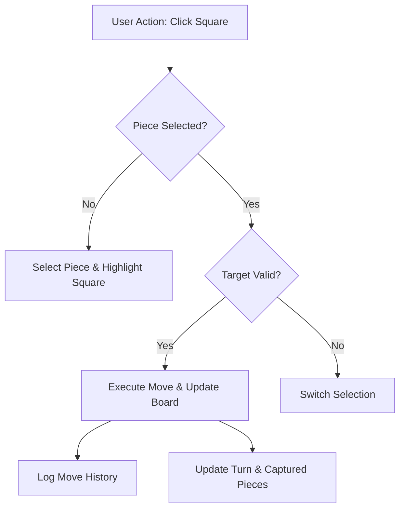

# 👑 Chess Game App (Tier 1)

An interactive, 2-player browser-based Chess engine featuring move validation, piece capture tracking, interactive move history, and turn indicators.

---

## 👨‍💻 Author Details

- **Developer**: karthi06vsbian
- **GitHub**: [github.com/karthi06vsbian](https://github.com/karthi06vsbian)
- **Category**: Web Application / Game Development

---

## 🎯 User Stories & Features

- [x] **Interactive 8x8 Board**: Rendered dynamically using modern CSS Grid and custom styling.
- [x] **2-Player Local Play**: Alternating White and Black turns with turn indicators.
- [x] **Piece Selection & Movement**: Click-to-select and move pieces with visual feedback.
- [x] **Captured Piece Tracking**: Displays captured white and black pieces separately.
- [x] **Move History & Undo**: Track past moves and undo previous moves seamlessly.

---

## 🏗️ Architecture Diagram

---

## 🛠️ Tech Stack

- **HTML5**: Semantic game markup
- **CSS3**: CSS Grid, Flexbox, custom design tokens
- **JavaScript (ES6+)**: Game state management, event listeners, move execution

---

## 🚀 How to Run

1. Open `index.html` directly in any web browser.
2. Click on a piece of the active turn to select it, then click the destination square.
